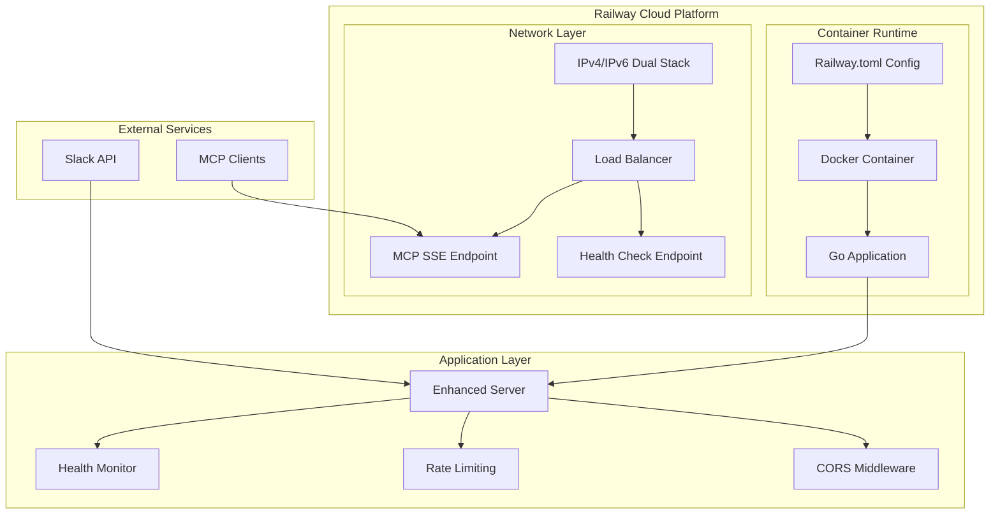

# Design Document

## Overview

This design enhances the Slack MCP Server to support Railway.app deployment with IPv6 compatibility and robust remote MCP server capabilities. The solution builds upon the existing SSE transport mode while adding cloud deployment configuration, dual-stack networking, health monitoring, and enhanced security features for production use.

## Architecture

### Current Architecture Analysis

The existing system has:
- **Transport Layer**: Supports both stdio and SSE transports
- **Server Structure**: Echo-based HTTP server for SSE transport
- **Caching**: File-based JSON caching for users and channels
- **Logging**: Structured logging with zap, environment-aware formatting

### Enhanced Architecture



## Components and Interfaces

### 1. Railway Configuration Component

**File**: `railway.toml`
- **Purpose**: Define Railway deployment configuration
- **Key Features**:
  - Build configuration using existing Dockerfile
  - Environment variable mapping
  - Health check configuration
  - Port binding configuration

### 2. Enhanced Network Binding

**Files**: `cmd/slack-mcp-server/main.go`, `pkg/server/server.go`
- **Current**: Binds to IPv4 only (`127.0.0.1` or `0.0.0.0`)
- **Enhancement**: Dual-stack IPv4/IPv6 binding
- **Implementation**:
  - Detect Railway environment via `PORT` environment variable
  - Use `net.Listen("tcp", ":port")` for dual-stack binding
  - Fallback to IPv4-only if IPv6 unavailable

### 3. Health Check System

**New File**: `pkg/server/health.go`
- **Endpoints**:
  - `GET /health` - Basic health status
  - `GET /health/ready` - Readiness check (Slack API connectivity)
  - `GET /health/live` - Liveness check (application responsiveness)
- **Response Format**:
```json
{
  "status": "healthy|unhealthy",
  "timestamp": "2024-01-01T00:00:00Z",
  "version": "v1.0.0",
  "checks": {
    "slack_api": "ok|error",
    "cache": "ok|error"
  }
}
```

### 4. Security and CORS Middleware

**New File**: `pkg/server/middleware/security.go`
- **CORS Support**: Configurable origins via `SLACK_MCP_CORS_ORIGINS`
- **Security Headers**: Add standard security headers for private network deployment
- **Rate Limiting**: Per-IP rate limiting via `golang.org/x/time/rate`
- **Request Validation**: Basic request validation and sanitization

### 5. Remote MCP Server Enhancements

**Enhanced Files**: `pkg/server/server.go`
- **Base URL Configuration**: Support external base URLs for Railway
- **WebSocket Upgrade**: Ensure proper WebSocket handling for SSE
- **Connection Management**: Handle connection timeouts and cleanup
- **Error Handling**: Standardized HTTP error responses

## Data Models

### Configuration Structure

```go
type ServerConfig struct {
    Host           string        // Bind host (empty for dual-stack)
    Port           string        // Port from Railway or env
    BaseURL        string        // External base URL
    CORSOrigins    []string      // Allowed CORS origins
    RateLimit      time.Duration // Rate limit per IP
    HealthCheck    HealthConfig  // Health check configuration
    TLS            TLSConfig     // TLS configuration
}

type HealthConfig struct {
    Enabled         bool          // Enable health endpoints
    SlackTimeout    time.Duration // Slack API check timeout
    CacheTimeout    time.Duration // Cache check timeout
}
```

### Health Check Response

```go
type HealthResponse struct {
    Status    string            `json:"status"`
    Timestamp time.Time         `json:"timestamp"`
    Version   string            `json:"version"`
    Checks    map[string]string `json:"checks"`
    Uptime    time.Duration     `json:"uptime,omitempty"`
}
```

## Error Handling

### HTTP Error Responses

Standardized error format for all HTTP endpoints:

```json
{
  "error": {
    "code": "RATE_LIMIT_EXCEEDED",
    "message": "Too many requests from this client",
    "details": "Rate limit of 60 requests per minute exceeded"
  },
  "timestamp": "2024-01-01T00:00:00Z",
  "path": "/sse"
}
```

### Error Categories

1. **Rate Limiting Errors** (429)
   - Too many requests from IP
   - Configurable retry-after header

3. **Health Check Errors** (503)
   - Slack API unreachable
   - Cache system failure

4. **Network Errors** (500)
   - IPv6 binding failures
   - Port binding conflicts

## Testing Strategy

### Unit Tests

1. **Network Binding Tests**
   - IPv4/IPv6 dual-stack binding
   - Fallback to IPv4-only
   - Port configuration from environment

2. **Health Check Tests**
   - Health endpoint responses
   - Slack API connectivity checks
   - Cache system validation

3. **Security Middleware Tests**
   - CORS header handling
   - Rate limiting functionality
   - Security header validation

### Integration Tests

1. **Railway Deployment Tests**
   - Container build and startup
   - Environment variable injection
   - Health check endpoint accessibility

2. **Remote MCP Tests**
   - SSE connection establishment
   - MCP protocol compliance over HTTP
   - CORS and security header validation

3. **IPv6 Connectivity Tests**
   - Dual-stack client connections
   - IPv6-only client support
   - Fallback behavior testing

### Load Tests

1. **Concurrent Connection Tests**
   - Multiple SSE clients
   - Rate limiting under load
   - Memory usage monitoring

2. **Health Check Performance**
   - Health endpoint response times
   - Slack API check timeouts
   - System resource usage

## Implementation Phases

### Phase 1: Railway Configuration
- Create `railway.toml` configuration
- Update Dockerfile for Railway compatibility
- Environment variable handling for Railway

### Phase 2: IPv6 Support
- Modify network binding logic
- Add dual-stack support
- Implement IPv6 address logging

### Phase 3: Health Monitoring
- Implement health check endpoints
- Add Slack API connectivity checks
- Create structured health responses

### Phase 4: Security Enhancements
- Add CORS middleware
- Implement rate limiting
- Add basic security headers for private network deployment

### Phase 5: Remote MCP Optimization
- Enhance SSE server configuration
- Improve error handling
- Add connection management

## Configuration Reference

### Environment Variables

**Railway-Specific:**
- `PORT` - Railway-provided port (overrides `SLACK_MCP_PORT`)
- `RAILWAY_ENVIRONMENT` - Railway environment name

**New Configuration:**
- `SLACK_MCP_CORS_ORIGINS` - Comma-separated allowed origins
- `SLACK_MCP_RATE_LIMIT` - Requests per minute per IP (default: 60)
- `SLACK_MCP_BASE_URL` - External base URL for Railway deployment
- `SLACK_MCP_HEALTH_ENABLED` - Enable health endpoints (default: true)
- `SLACK_MCP_SECURITY_HEADERS` - Enable security headers (default: true)

**Enhanced Existing:**
- `SLACK_MCP_HOST` - Now supports empty for dual-stack binding
- `SLACK_MCP_PORT` - Fallback when `PORT` not available

### Railway.toml Structure

```toml
[build]
builder = "dockerfile"
dockerfilePath = "Dockerfile"

[deploy]
healthcheckPath = "/health"
healthcheckTimeout = 30
restartPolicyType = "on_failure"

[[deploy.environmentVariables]]
name = "SLACK_MCP_HOST"
value = ""

[[deploy.environmentVariables]]
name = "SLACK_MCP_HEALTH_ENABLED"
value = "true"
```